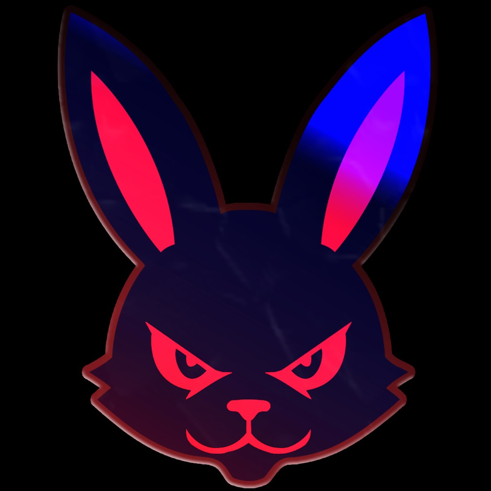

# Temple Run 2 HACKED BY BUNS

  

> **This is NOT the official Temple Run 2 app.**  
> This is a **custom sideload IPA** made by **Buns** for fans / YouTube subscribers.  
> Not affiliated with Imangi Studios or the App Store version.

**YouTube:** [youtube.com/@BunsDeveloper](https://www.youtube.com/@BunsDeveloper)

---

## Download

Get the IPA from the latest **[Release](https://github.com/FaZeBuns/TR2-Hacked-By-Buns/releases/latest)**  
File name: `TR2_Hacked_By_Buns.ipa` (~121 MB)

---

## What this build includes

- Custom **HACKED BY BUNS** popup every time you open the app (Subscribe / OK)
- Max coins / gems
- All characters unlocked
- All maps unlocked
- Hats / pets / collectables unlocked
- Rank / level gates bypassed
- Works best with **TrollStore** (separate app — does not replace App Store Temple Run 2)

---

## Install (TrollStore)

1. Download `TR2_Hacked_By_Buns.ipa` from **Releases**
2. Open the IPA in **TrollStore** → **Install**
3. If you already have an older "TR2 HACKED BY BUNS", **delete it first**
4. Open the app → tap **OK** on the Buns popup (Subscribe is optional)

### Sideloadly (no TrollStore)
1. Install [Sideloadly](https://sideloadly.io/)
2. Drag the IPA in, sign with your Apple ID
3. Trust the certificate under **Settings → General → VPN & Device Management**
4. Free Apple IDs usually need a re-sign every ~7 days

---

## Important notes

- Bundle ID: `com.buns.tr2.hacked` (separate from the App Store game)
- Keep the official Temple Run 2 if you want — both can exist
- First open: wait a few seconds in the hub for unlocks to apply

---

## Support / more builds

Subscribe for updates & more iOS projects:  
**https://www.youtube.com/@BunsDeveloper**

---

## Disclaimer

Provided as-is for educational / entertainment sharing of a **custom personal build**.  
You are responsible for how you install and use sideloaded software on your own device.  
Imangi / Apple trademarks belong to their respective owners.
